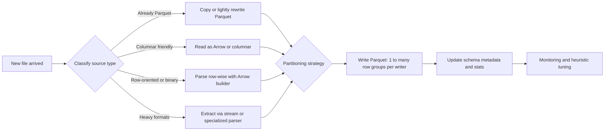

Great question. For 100+ source formats into Parquet, you won’t tune each one manually. What you need are robust heuristics (rules of thumb) that decide:

- How to ingest
- How to parallelize
- How to convert to Parquet
- How to partition and layout the output

Here’s a structured, practical list of heuristic-based speedups.

---

## High-level answer (tl;dr):

- Classify sources by “expensiveness” and treat them differently.
- Use parallel, streaming ingestion (no full materialization in memory).
- Favor direct Arrow/Parquet paths where possible.
- Push schema work earlier and stabilize schemas fast.
- Write Parquet in large row groups, narrow partitions, with sensible compression/encoding.
- Use backpressure and batching rather than “one file = one task”.

## Mermaid overview of heuristic pipeline

This shows the main decision points and heuristics:

## Now the detailed heuristic list:

### 1) Source-type classification heuristics

Treat all 100+ file types as a few performance “buckets” so you can apply generic rules instead of per-type tweaks:

- Bucket 1 – Native/near-native Parquet/ORC:
  - Parquet, ORC, sometimes Avro (when row-oriented but cheap).
  - Heuristic:
    - Avoid full decode: try to:
      - Copy directly, or
      - Read with vectorized Parquet/ORC reader and rewrite with minimal projection.
    - Only do full parsing if you must transform, filter, or rename columns.
- Bucket 2 – Text-based row formats:
  - CSV, TSV, pipe-delimited, log files, JSON Lines (newline-delimited JSON).
  - Heuristic:
    - Use streaming + Arrow builders (e.g., PyArrow / Arrow Rust), not “string → object → Arrow”.
    - Use type inference once on a sample, then apply to the stream (don’t re-infer per file for same schema).
- Bucket 3 – Nested/hierarchical text:
  - Multi-line JSON, XML, YAML, nested logs.
  - Heuristic:
    - Prioritize “tree-shaking”: skip or ignore branches you don’t need during parsing.
    - Prefer streaming parsers (SAX-style, JSON streaming, etc.) and flatten early if target is a relational layout【turn0search4】.
- Bucket 4 – Binary blobs / archives / docs:
  - ZIP, tar, PDF, Office docs, proprietary app exports.
  - Heuristic:
    - Assume these are “slow” and expensive:
      - Limit in-flight files of this type (concurrency cap).
      - Isolate to a dedicated pool to prevent head-of-line blocking for cheap formats.
    - If these contain structured payloads (e.g., CSV inside a ZIP), stage extraction to a fast intermediate zone (e.g., uncompressed CSV files on local SSD or NVMe), then ingest using normal rules.

## 2) Ingestion I/O and layout heuristics

- Heuristic 1 – Keep ingestion data close to compute:
  - If files land in object storage (S3, GCS, ADLS):
    - Use a compute tier close to that storage (same region, VPC/VNet, etc.).
    - For small/many files, copy locally first or use a caching/accelerating layer (e.g., local NVMe, or a cache filesystem) to reduce remote round-trips【turn0search1】.
- Heuristic 2 – Prefer streaming reads:
  - Don’t try to fit entire file in memory; stream chunks (e.g., 4–64 MB at a time).
  - For large files, this reduces memory pressure and allows larger file size per job.
- Heuristic 3 – Group small files into batches:
  - For formats where merging is cheap (text, JSONL, CSV):
    - Batch many small files into one logical stream/task:
      - e.g., read 100 small CSVs as one combined stream and write a single output Parquet file.
    - Avoid one-task-per-file for millions of tiny objects; aim for “one task ≈ 256 MB–1 GB of input”.

## 3) Parallelism and task sizing heuristics

- Heuristic 4 – Size tasks by bytes and format cost:
  - Default target:
    - 256 MB–1 GB of raw input data per ingest/convert task.
  - Adjust based on source type:
    - “Cheap” (Parquet/ORC): 512 MB–1 GB per task.
    - “Medium” (CSV, JSONL): 256–512 MB per task.
    - “Expensive” (XML, PDF, proprietary blobs): 64–256 MB per task.
- Heuristic 5 – Limit concurrency by “expensive” formats:
  - Use separate concurrency limits:
    - Cheap formats: many parallel tasks (saturate disk/network).
    - Expensive formats: small pool (e.g., 2–4x CPU cores, not 20x).
  - Heuristic rule:
    - Cap concurrent heavy-parse tasks such that total CPU usage stays ≤70–80%, leaving headroom for IO and other work.
- Heuristic 6 – Locality-aware file assignment (if on a cluster):
  - For distributed clusters (Spark, Dask, Ray, Flink, etc.):
    - Prefer “data-local tasks” when possible (HDFS/POSIX-like semantics).
    - When nodes have different storage speeds (SSD vs HDD):
      - Assign heaviest (most parse-expensive) files to the fastest local storage nodes.
  - This follows research on “sorted assignment” where grouping similar-cost tasks/files to similar workers improves throughput【turn0search11】.

## 4) Format- and path-specific heuristics

- Heuristic 7 – Go Arrow/Parquet-native whenever possible:
  - If a source format library reads directly into Arrow (e.g., PyArrow for CSV/JSON/Parquet), use that instead of going through pandas/dataframes or intermediate objects.
  - Rationale: Arrow + Parquet together minimize copies and conversions, which is critical for high ingest rates【turn0search8】【turn0search9】.
- Heuristic 8 – Skip JSON ↔ CSV intermediate steps:
  - Many tools internally convert JSON → CSV → Parquet. That’s often wasteful.
  - Heuristic:
    - Prefer JSON → Arrow → Parquet in one pass.
    - If a tool or framework doesn’t support it, consider patching or replacing that stage.
- Heuristic 9 – Use columnar/semi-columnar intermediate formats:
  - For multi-stage pipelines (raw → bronze → silver), use Parquet or Arrow in at least one intermediate layer instead of staying on row formats.
  - This helps because later stages can read only needed columns with vectorized scanners【turn0search5】【turn0search17】.

## 5) Schema inference and evolution heuristics

- Heuristic 10 – Infer once, apply many:
  - For a recurring source (same producer, same pattern, new file every minute):
    - Do schema inference on a sample (e.g., first 100 MB or first N files).
    - Cache the schema and apply to all subsequent files until evolution is detected.
- Heuristic 11 – Detect schema drift with sampling:
  - On a subset of new files (random or every Nth file), run a lightweight “schema check”:
    - If new fields or types appear, trigger a controlled schema evolution job, not per-file dynamic schema.
  - Heuristic threshold:
    - Don’t allow per-task schema changes; centralize schema changes to an admin/batch process to avoid fragmented Parquet schemas【turn0search8】.
- Heuristic 12 – Default to nullable and widest-compatible types:
  - When in doubt:
    - Use nullable types to avoid per-file crashes on missing values.
    - Prefer “wider” types (e.g., int64 instead of int32) if there’s ambiguity.
    - You can optimize types later with a separate “type narrowing” pass.

## 6) Parquet writing heuristics (for conversion)

- Heuristic 13 – Target large row groups:
  - Aim for row group size in the 64–128 MB range (compressed) for analytical workloads【turn0search5】【turn0search6】.
  - Too small row groups:
    - Lots of metadata overhead, slower reads.
  - Too large:
    - Less predicate pushdown efficiency; slower to skip irrelevant data.
- Heuristic 14 – Limit number of distinct writers/flushes:
  - Better to have fewer writers writing larger files than many writers writing tiny files.
  - Heuristic:
    - Merge logical partitions within the same job into one Parquet writer per output partition (e.g., one writer per hive-partition directory, per time bucket, or per source system).
- Heuristic 15 – Choose compression wisely:
  - Default heuristics:
    - General-purpose analytical workloads: Snappy or ZSTD.
      - Snappy: faster, moderate compression.
      - ZSTD: better compression, somewhat slower; good when storage cost or network transfer dominates【turn0search5】.
    - Avoid heavy compression (e.g., high-level Gzip) for hot/interactive data.
  - Format-specific heuristics:
    - Highly repetitive string columns: ZSTD + dictionary encoding works well【turn0search7】【turn0search9】.
    - Numeric IDs / enums: dictionary encoding + RLE + Snappy/ZSTD is usually a good combo【turn0search7】.

## 7) Encoding and data-layout heuristics

- Heuristic 16 – Use dictionary encoding for low-cardinality columns:
  - For strings or enums with relatively few distinct values:
    - Favor dictionary encoding; it’s usually a win for both storage and read performance【turn0search7】【turn0search9】.
- Heuristic 17 – Avoid over-encoding:
  - Many engines auto-choose encoding based on data characteristics.
  - If you manually tune:
    - Only override when you’re sure:
      - e.g., you know a column is always 32-bit ints; enforce INT32.
    - Otherwise, let default encoding choices apply; over-tuning can backfire.

## 8) Partitioning, clustering, and file-count heuristics

- Heuristic 18 – Coarse-grained partitions:
  - Don’t partition by high-cardinality fields like user_id or transaction_id.
  - Typical heuristic:
    - Partition by time (date, hour) or by low-cardinality dimensions like region / source_system.
    - Target directory size: a few hundred MB to a few GB per partition, not tiny directories per file or per high-cardinality value.
- Heuristic 19 – Aim for medium file sizes:
  - After ingest:
    - Target Parquet file size in the 256 MB–1 GB range (compressed) for most analytical lakes.
    - Too many tiny files = bad metadata blowup and slow queries; too few huge files = limits concurrency of readers【turn0search5】.
- Heuristic 20 – Compact periodically:
  - For frequent ingest (small files every minute):
    - Heuristic schedule:
      - Run a compaction job that merges small files into larger ones:
        - For example, when the average file size in a partition drops below 128 MB, compact.
      - This keeps your read-side path fast even if ingest is granular.

## 9) Buffering, backpressure, and batching heuristics

- Heuristic 21 – Use bounded queues and backpressure:
  - If ingestion is pulling from a queue or topic:
    - Use in-memory queues with size limits (e.g., 10–20k records per queue).
    - When queues hit high watermark:
      - Pause or slow down reads from the source until ingestion catches up.
- Heuristic 22 – Batch writes rather than row-at-a-time:
  - For both Arrow builders and Parquet writers:
    - Aim for batches in the 1k–100k row range before internal flushes or conversions.
    - Many frameworks auto-batch; if you implement your own, tune batch size for throughput vs latency.
- Heuristic 23 – Favor columnar batches:
  - Work with column batches (Arrow RecordBatches) rather than row-by-row Python/Java loops.
  - Vectorized operations (on batches) are much faster due to SIMD and cache locality【turn0search9】.

## 10) Monitoring and adaptive heuristics

- Heuristic 24 – Profile per format, not just in aggregate:
  - Keep simple metrics per format:
    - Ingest bytes/sec
    - Parquet write bytes/sec
    - Parse time vs write time ratio
  - Use them to adjust:
    - Concurrency per format
    - Batch sizes
    - Whether to invest in optimizing parsers for that format.
- Heuristic 25 – Use simple rules to auto-tune:
  - Example adaptive rules:
    - If CSV parse time > 2× Parquet write time:
      - Increase CSV batch size or improve CSV parsing (e.g., move to a faster library or more specialized parser).
    - If Parquet write time > 2× CSV parse time:
      - Consider adjusting row group size, compression, or using more writers in parallel.
    - If latency is dominated by “heavy” formats (XML/office docs):
      - Consider an offline/preprocess step that extracts only needed fields into a lighter intermediate format, and keep the original for audit.

## 11) Tool/framework-level heuristics

- Heuristic 26 – Prefer engines with vectorized scanners:
  - Engines like Snowflake, Spark (with Parquet), and modern Parquet readers use vectorized scanners that can significantly improve Parquet ingestion performance【turn0search17】.
- Heuristic 27 – Leverage “auto-ingest” or “shortcut” features where available:
  - Some platforms have pre-tuned ingestion flows that convert multiple file types directly to Delta/Parquet with optimizations (schema merging, compression handling, etc.)【turn0search15】【turn0search16】.
  - Heuristic:
    - When available, use them instead of writing your own loader unless you have very specific performance or cost constraints.
- Heuristic 28 – Use connectors/SDKs that write Parquet directly:
  - If you’re building custom ingestors:
    - Use SDKs that write Parquet (Arrow, fastparquet, etc.) instead of converting through another format.
  - This reduces transformation overhead and improves end-to-end throughput【turn0search8】【turn0search9】.

If you want, I can next turn this into a concrete decision table like:

- “If source is X and size is Y and frequency is Z, use this ingest strategy + these Parquet settings.”

with example parameter ranges for common setups (e.g., Spark vs Arrow-based ingest vs Flink).
